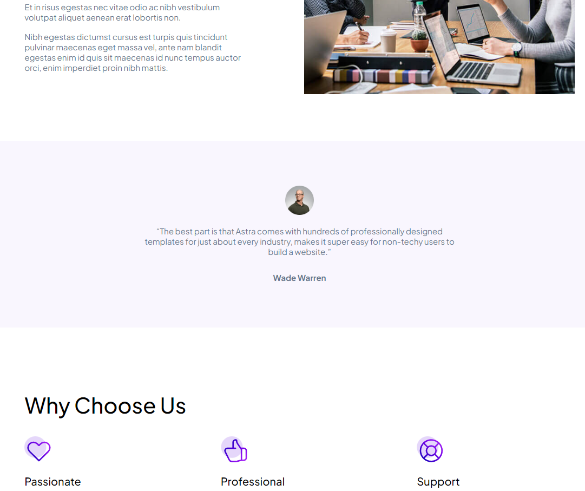
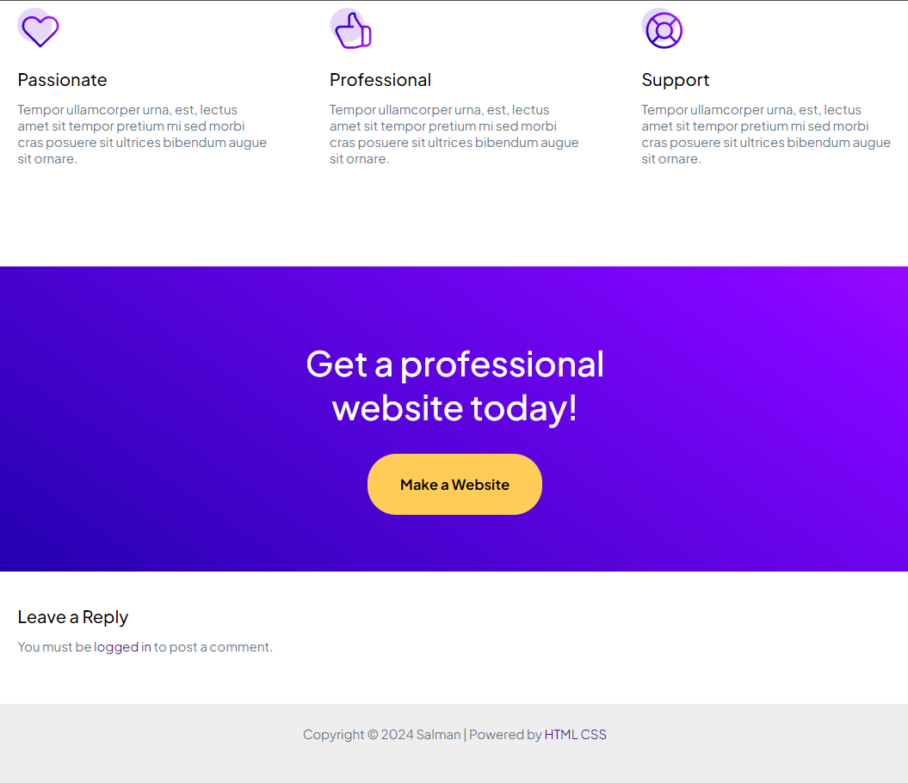

# LAYOUT WEBSITE ASTRA

**Layout Website Astra** adalah desain antarmuka yang dirancang dengan estetika modern dan responsif. Layout ini cocok untuk berbagai jenis website, baik untuk bisnis, portofolio, maupun blog. Dengan kombinasi elemen yang bersih dan terorganisir, pengguna dapat menjelajahi konten dengan mudah dan nyaman.

## Fitur Utama
- **Navigasi yang Mudah**: Menu navigasi yang intuitif dengan opsi untuk berpindah antar bagian dalam sekejap.
- **Section yang Terstruktur**: Terdapat beberapa section seperti layanan, tentang, testimonial, dan kontak yang membantu menampilkan informasi dengan jelas.
- **Visual yang Menarik**: Menggunakan gambar dan gradient warna yang memikat, menciptakan kesan yang menarik dan profesional.

## Struktur Halaman
1. **Header**: Berisi navigasi utama untuk akses cepat ke berbagai bagian website.
2. **Primary Section**: Menyajikan tagline dan ajakan untuk bertindak dengan latar belakang menarik.
3. **Secondary Section**: Menampilkan layanan atau produk yang ditawarkan dengan ikon yang relevan.
4. **Services Section**: Memberikan detail tentang layanan yang disediakan.
5. **About Section**: Memperkenalkan informasi tentang perusahaan atau individu yang mendasari website.
6. **Reviews Section**: Menampilkan testimonial pengguna untuk membangun kepercayaan.
7. **Why Choose Us Section**: Menggambarkan alasan kuat untuk memilih layanan yang ditawarkan.
8. **Contact Section**: Mendorong pengunjung untuk mengambil tindakan dan berhubungan.
9. **Footer**: Berisi hak cipta dan informasi tambahan yang relevan.

## Cara Memakai
1. Salin file layout ke dalam folder proyek website kamu.
2. Sesuaikan konten di dalam section sesuai kebutuhanmu (teks, gambar, dan tautan).
3. Implementasikan file CSS yang diperlukan untuk mendukung tampilan dan fungsi.

## Teknologi yang Digunakan
- HTML
- CSS

---

